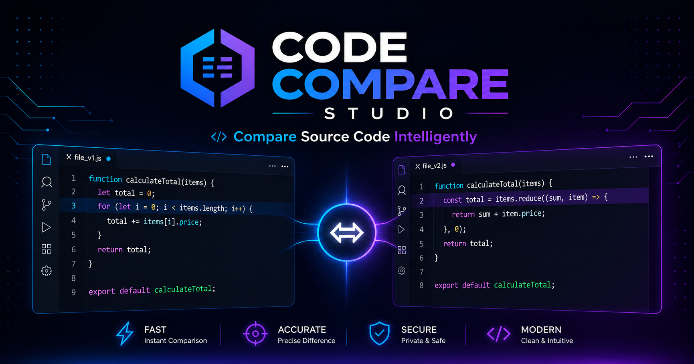

> 🇮🇷 [Persian README](README.fa.md)

# Code Compare

A simple and interactive web-based tool for comparing your code with a reference implementation.

Code Compare lets you enter your code alongside a reference code and quickly check whether they match. It provides a clean coding environment powered by the Monaco Editor and runs entirely in the browser.

## ✨ Features

- Compare your code against a reference implementation
- Instant comparison results
- Built-in code editor powered by Monaco Editor
- Clean and simple user interface
- Runs directly in the browser
- No backend or installation required
- Lightweight and easy to use
- Supports working with HTML, CSS, JavaScript, JSON, PHP, Python and C++

## 🚀 Live Demo

Try Code Compare directly in your browser:

**[Live Demo](https://mamsm-dev.github.io/code-compare/)**

## 📸 Preview



## 🛠️ Built With

- **HTML** — Application structure
- **CSS** — Styling and layout
- **JavaScript** — Comparison logic and application behavior
- **Monaco Editor** — Code editing experience

## 📖 How It Works

Code Compare provides two code inputs:

1. **Your Code** — Enter or write the code you want to test.
2. **Reference Code** — Provide the expected or reference implementation.

The application compares the two inputs and lets you know whether your code matches the reference code.

This makes the tool useful for quickly checking code submissions, practicing coding exercises, or comparing implementations.

## 💻 Getting Started

### Run Locally

Clone the repository:

```bash
git clone https://github.com/mamsm-dev/code-compare.git
```

Navigate to the project directory:

```bash
cd code-compare
```

Then open `index.html` in your browser.

No package manager or build process is required.

## 📁 Project Structure

```text
code-compare/
├── css/
│   └── ...
├── js/
│   └── ...
├── monaco/
│   └── ...
├── image/
│   └── ...
├── index.html
├── preview.png
└── README.md
```

## 🎯 Use Cases

Code Compare can be useful for:

- Practicing coding exercises
- Checking solutions against reference code
- Comparing different implementations
- Learning HTML, CSS, and JavaScript
- Quickly validating code during development
- Educational coding environments

## 🌐 Browser Based

Code Compare is designed to work directly in the browser. There is no server-side setup or installation required.

Just open the application, enter your code and reference code, and compare them.

## 🤝 Contributing

Contributions, suggestions, and improvements are welcome.

If you have an idea for improving Code Compare:

1. Fork the repository
2. Create a new branch

   ```bash
   git checkout -b feature/your-feature
   ```

3. Make your changes
4. Commit your changes

   ```bash
   git commit -m "Add your feature"
   ```

5. Push the branch

   ```bash
   git push origin feature/your-feature
   ```

   ```bash
   git push origin feature/your-feature
   ```

6. Open a Pull Request

## 📄 License

This project is open source. See the repository for the applicable license and usage terms.

## 👨‍💻 Author

Created by [mamsm-dev](https://github.com/mamsm-dev).

---

⭐ If you find this project useful, consider giving it a star!
